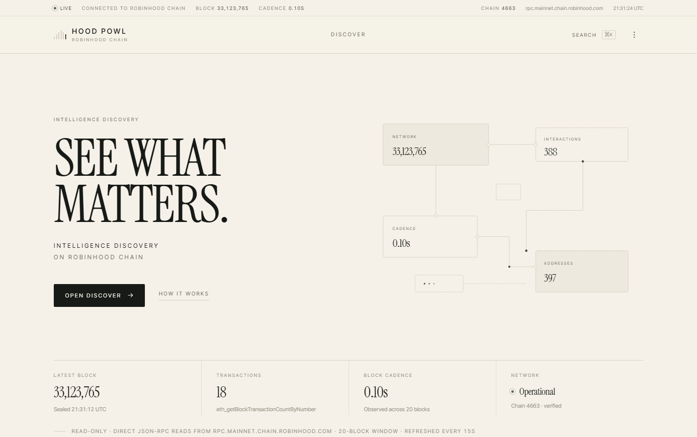
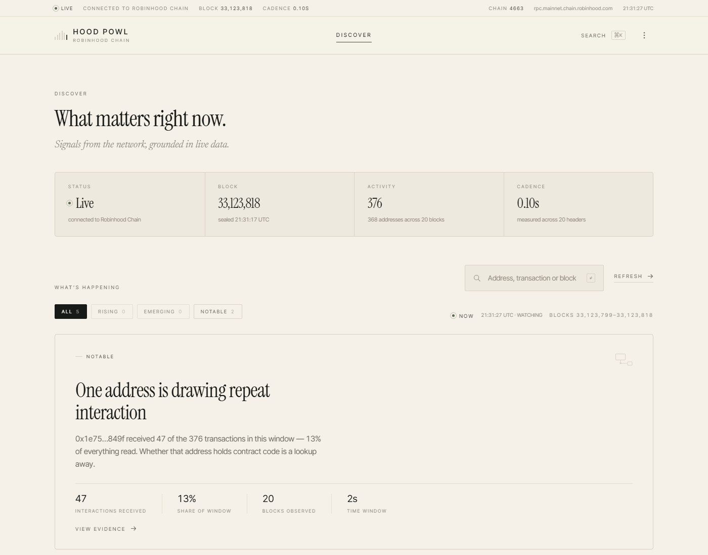
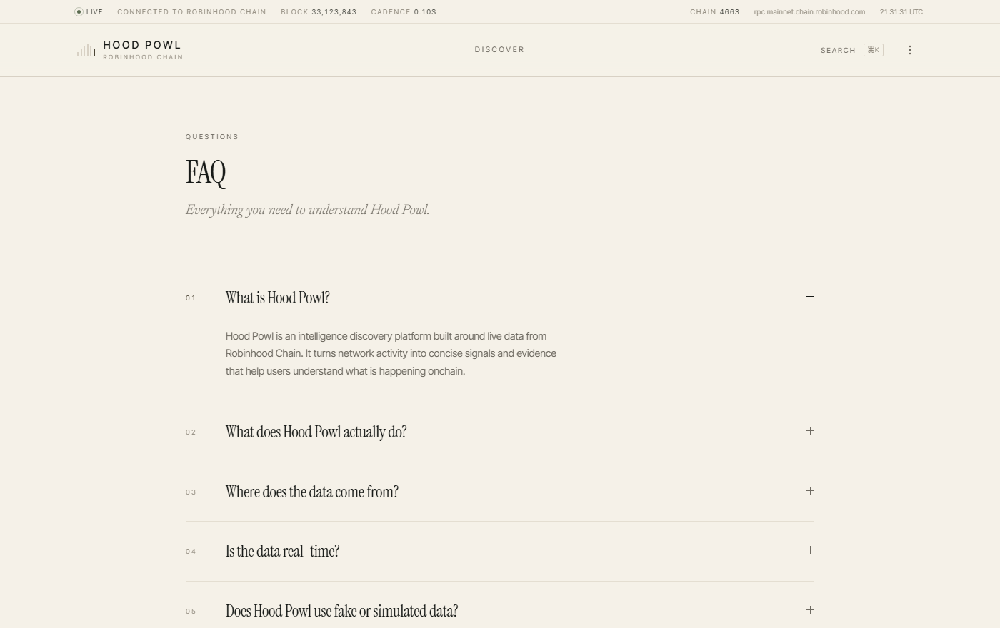

# Hood Powl

**Intelligence discovery on Robinhood Chain.** Read-only, evidence first.

Hood Powl reads Robinhood Chain directly over JSON-RPC and turns what it finds into short,
checkable signals — what changed, why it matters, and the exact counts the claim was derived from.
No wallet, no account, no index of its own, and no number on the page that a node did not answer.



<p>
  
  
  
  
</p>

---

## What it is

One self-contained `index.html`. No framework, no bundler, no package manager, no server of its
own — open the file and it starts reading the chain. Everything below is implemented inside that
single file: the RPC transport, the intelligence rules, the router, and the design system.

It is deliberately **not** a wallet, an exchange, a portfolio tracker or a price dashboard.

## How it works

```
Robinhood Chain RPC  ──►  20-block window  ──►  rules  ──►  signal cards
   (canonical)            re-read every 15s      │           each with its counts
                                                 │
Blockscout v2 API  ───────────────────────────►  └──►  evidence panel
   (indexed context, only when you open a card)
```

**The RPC is canonical.** Every measurement and every figure on a card comes from
`eth_*` calls against `rpc.mainnet.chain.robinhood.com`: `eth_blockNumber`, `eth_chainId`,
`eth_getBlockByNumber`, `eth_getBlockTransactionCountByNumber`, `eth_getTransactionByHash`,
`eth_getTransactionReceipt`, `eth_getLogs`, `eth_getCode`, `eth_call`.

**Blockscout is secondary.** It adds only what a node cannot cheaply answer — decoded method
names, lifetime counters, verified contract identity, holder counts. That instance publishes
`x-ratelimit-limit: 10`, so those calls are made *only* in response to a user action, never on the
refresh path, and are cached for two minutes with a 7s timeout. If Blockscout fails, the section is
omitted and the RPC-derived product is untouched.

| | |
|---|---|
| Observation window | 20 blocks (~2s of chain time at current cadence) |
| Refresh | every 15s while the tab is visible |
| Cadence measurement | across 20 headers |
| Chain | 4663 (`0x1237`), verified against `eth_chainId` on every pass |

## The signals it can raise

Each one is a fixed rule over the counts in the current window — not a model, not an opinion:

- **Activity is rising / easing / holding steady** — this window against the previous one
- **A new contract was deployed** — creation transactions in the window
- **One address is drawing repeat interaction** — a recipient concentrating the window's traffic
- **A large transfer moved through the window** — the outlier by value
- **The most transferred token here** — by `Transfer` log volume, resolved via `name()` / `symbol()`
- **Addresses appear that were not in the previous window** — new participants
- **Block height and cadence** — the network's own baseline

Every card opens into an evidence panel carrying the counts the rule saw, plus the addresses,
blocks and transactions behind them. Each of those is clickable and runs a live lookup against the
same node.



## Pages

| Route | What it holds |
|---|---|
| `#discover` | The intelligence feed — signals, filterable by category |
| `#record` | Every read, chronologically: blocks and transactions in plain language |
| `#docs` | Exactly which calls are made and how each signal is derived |
| `#blog` | Method notes (intentionally empty until something real is written) |
| `#faq` | 21 questions about what it reads and what it refuses to claim |



## Running it

No build step, no install:

```bash
git clone https://github.com/trevioos/hoodpowl.git
cd hoodpowl
python -m http.server 8000     # then open http://localhost:8000
```

Opening `index.html` straight from disk works too — the RPC answers with
`access-control-allow-origin: *`.

### Configuration

Both are query parameters, useful for pointing at a test node:

```
?rpc=<url>            # override the JSON-RPC endpoint
?blockscout=<url>     # override the indexed evidence layer
```

The endpoint actually in use is always printed in the status line at the top of the page.

## Rules this project keeps

1. **No fabricated data.** There is no seed data, no placeholder value and no fallback anywhere in
   the file. A failed read renders `Unavailable` together with the reason — an HTTP status, an RPC
   error, or a request the browser blocked.
2. **No unreadable claims.** Price, market cap and holder counts are absent because a node cannot
   answer them. Hood Powl would have to guess, so it leaves them out.
3. **Every claim carries its evidence.** If a card states a number, the panel underneath shows where
   that number came from and lets you look it up yourself.
4. **Read-only.** Nothing on the page can ask you to connect a wallet or sign anything.

## Design

A warm cream editorial system, defined as CSS custom properties at the top of the file: paper
`#F5F1E8`, ink `#171A17`, hairline rules, 2px radii. Instrument Serif for display, Inter Tight for
UI, Newsreader italic for editorial asides. Motion is restrained and respects
`prefers-reduced-motion`.

## Layout

```
index.html      the entire application
docs/           screenshots used by this README
```

## License

[MIT](LICENSE).
